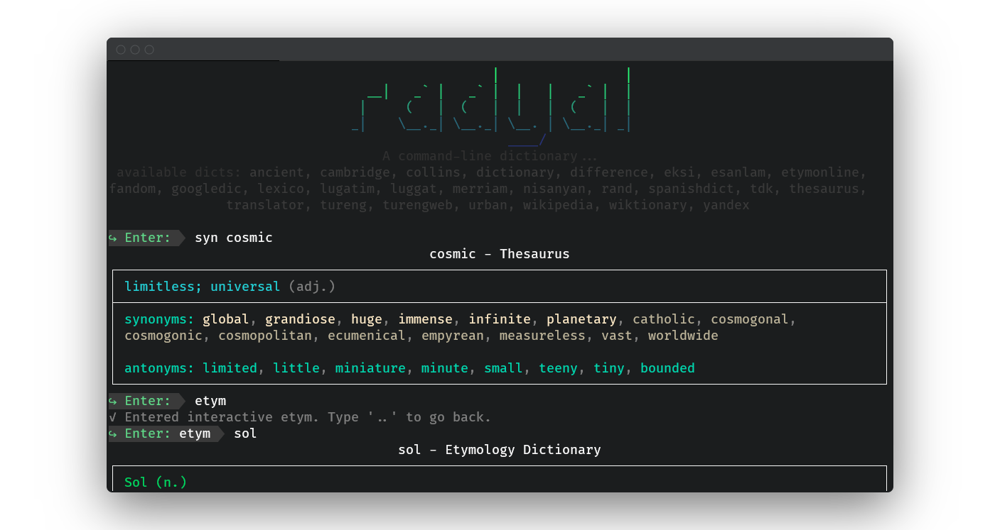

A command-line dictionary, translator, thesaurus and word tools from multiple online sources.

## Installation

`pip install radyal`

## Usage

```
> radyal <dic> <your input>
> radyal lexico metafiction
```

or

`> python3 -m radyal <dic> <word>`

### Interactive Usage:

```
# To enter the interactive mode
$ radyal
```

```
# give any input if it not math dicts key or commands
# it will run default dict
> <any input>
```

```
# dictionary key and input
> <dict key> <your inp>
> etym tree
```

```
# with just dict key you can enter
# interactive dictionary
> <dict key>
> etym
Entered interactive etym. Type '..' to go back.
etym> tree
```

Interactive Commands:

-   `compare`, compare outputs. example usage, `compare hey how are you google|yandex|bing`
-   `list`, show detailed list of all dicts. you can filter with language with given `list -en`, `list -fr`.
-   `clear`, clear the all terminal.
-   `help`, show help.
-   `exit`, exit the interactive mode.

### Cli Usage:

```
$ radyal <dic> <word>

# list all dicts
$ radyal list
$ radyal list -en

# help
$ radyal -h
```

## Dictionary List:

> list the [dicts.json]().

| Syntax    | Description |
| --------- | ----------- |
| Header    | Title       |
| Paragraph | Text        |
